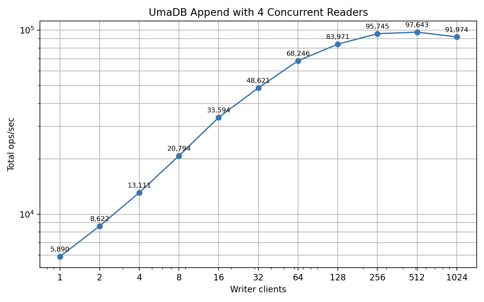
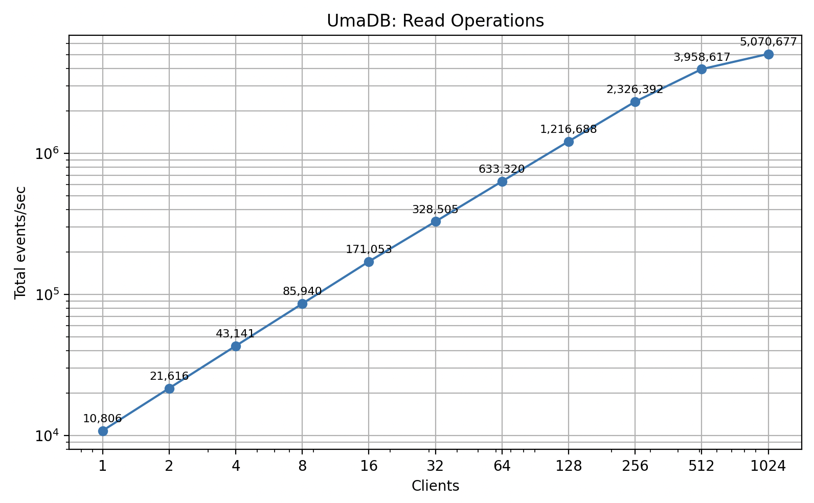
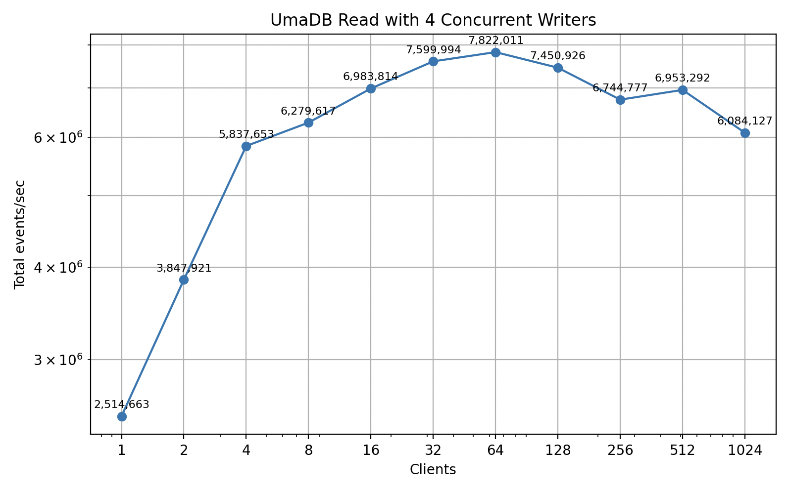

# UmaDB

UmaDB is an event store database designed for dynamic consistency boundaries. It
provides a robust foundation for event-driven architectures where consistency boundaries may
shift based on business requirements.

## Database Design

UmaDB stores data in a single paged file with fixed-size pages and an MVCC, copy-on-write update
strategy. A small header node records the transaction sequence number (TSN), the next free PageID,
and the roots for three B+ trees: the events tree (ordered by monotonically increasing Position),
the tags tree (for tag-based indexing), and the free-lists tree (for reusable page IDs).

Large event payloads are split across overflow pages and referenced from leaf records, while small payloads
are stored inline in the events tree pages.

Writers never mutate pages in place: they allocate new pages, write modified nodes, and on commit atomically
publish a new header that points to the new roots. Readers hold a TSN and can continue traversing the
old roots safely.

Concurrent append requests are collected into batches and processed sequentially, using dirty pages, before
flushing all changes to disk, after which individual responses to all client requests in the batch are sent.

Concurrent read requests are streamed in batches, using a new reader for each batch, which allows pages to be
reused quickly by avoiding hogging TSNs, which is especially important to support long-running subscription readers.

This design yields crash-safe commits, concurrent readers without blocking, and efficient space reuse via the free-lists tree. 

## Benchmarks

The benchmark plot below shows total append operations per second from concurrent clients. Each client
is writing one event per request.


The benchmark plot below shows total append operations per second for concurrent clients, whilst there are four other
clients concurrent reading events.



The benchmark plot below shows total throughput across concurrent client read operations, whilst clients are throttled
to process events at around 10,000 events per second. This plot shows concurrent readers scale quite linearly.



The benchmark plot below shows total throughput across concurrent client read operations, whilst clients are not throttled.
The rate is ultimately constrained by the CPU and network channel limitations.


The benchmark plot below shows total throughput across concurrent client read operations, whilst there are four other
clients concurrently appending events.



The benchmark plots above were produced on an Apple MacBook Pro M4.


## Quick Start

1. Build the project:
   ```bash
   cargo build --release
   ```

2. Start the gRPC server:
   ```bash
   ./target/release/grpc_server --path /path/to/event-store
   ```

3. In another terminal, run the example client:
   ```bash
   ./target/release/example_client
   ```

This will start a server, connect to it with the example client, append an event, and then read events from the event store.

## Building the Project

To build the project, you need to have Rust and Cargo installed. If you don't have them installed, you can get them from [rustup.rs](https://rustup.rs/).

Once you have Rust and Cargo installed, you can build the project with:

```bash
cargo build --release
```

This will create the executable in `target/release/`.

## Running the gRPC Server

The gRPC server can be started using the `grpc_server` binary. You can run it directly after building:

```bash
./target/release/grpc_server --path /path/to/event-store --address 127.0.0.1:50051
```

Or you can use `cargo run` (dev build, slower):

```bash
cargo run --bin grpc_server -- --path /path/to/event-store --address 127.0.0.1:50051
```

### Command-line Options

The gRPC server accepts the following command-line options:

- `-p, --path <PATH>`: Path to the event store directory (required)
- `-a, --address <ADDR>`: Address to listen on (default: "127.0.0.1:50051")
- `-h, --help`: Print help information
- `-V, --version`: Print version information

## Interacting with the gRPC Server

You can interact with the gRPC server using any gRPC client. The server implements the following methods:

- `Read`: Read events from the event store
- `Append`: Append events to the event store

### Using the Example Client

UmaDB includes an example client that you can use to interact with the gRPC server. You can run it with:

```bash
cargo run --bin example_client -- --address http://127.0.0.1:50051
```

The example client:
1. Connects to the gRPC server
2. Appends an event to the event store
3. Reads events from the event store using a query
4. Displays the events that were read

### Using the Rust Client in Your Own Code

UmaDB provides a Rust client that you can use to interact with the gRPC server in your own code. Here's an example of how to use it:

```rust
use umadb::dcbapi::{DCBEvent, DCBQuery, DCBQueryItem};
use umadb::grpc::GrpcEventStoreClient;

#[tokio::main]
async fn main() -> Result<(), Box<dyn std::error::Error>> {
    // Connect to the gRPC server
    let client = GrpcEventStoreClient::connect("http://127.0.0.1:50051").await?;

    // Append an event
    let event = DCBEvent {
        event_type: "example".to_string(),
        tags: vec!["tag1".to_string(), "tag2".to_string()],
        data: b"Hello, world!".to_vec(),
    };
    let position = client.append(vec![event], None).await?;
    println!("Appended event at position: {}", position);

    // Read events
    let query = DCBQuery {
        items: vec![DCBQueryItem {
            types: vec!["example".to_string()],
            tags: vec!["tag1".to_string()],
        }],
    };
    let mut stream = client.read(Some(query), None, None, false, None).await?;

    // Iterate through the events from the async stream
    use futures::StreamExt;
    while let Some(item) = stream.next().await {
        match item {
            Ok(event) => println!("Event at position {}: {:?}", event.position, event.event),
            Err(e) => {
                eprintln!("Stream error: {:?}", e);
                break;
            }
        }
    }

    Ok(())
}
```

## Subscriptions (catch-up and continue)

UmaDB supports catch-up subscriptions over gRPC. A subscription behaves like a normal read until it reaches the end of the currently recorded events, at which point it blocks instead of terminating and then continues delivering newly appended events.

Key semantics:
- Normal read (subscribe = false):
  - For unlimited reads (limit = None), the server captures a starting head boundary and will not stream past it. If new events are appended after the read starts, they are not included; the stream ends at the boundary.
  - For limited reads (limit = Some(n)), the stream ends after n matching events are sent.
- Subscription read (subscribe = true):
  - First delivers all existing matching events (respecting after/limit), then blocks when it reaches the current end.
  - When new matching events are appended, the stream resumes and continues delivering them.
  - If a limit is provided, the stream terminates after that many events even in subscription mode.
  - If the client drops the stream or the server shuts down, the stream terminates. The server actively signals shutdown to terminate ongoing subscriptions gracefully.
- Batch sizing: you can pass an optional batch_size hint; the server will cap it to its configured maximum.

Example: simple subscription from the beginning

```rust
use umadb::grpc::GrpcEventStoreClient;
use umadb::dcbapi::DCBEvent;
use futures::StreamExt;

#[tokio::main]
async fn main() -> Result<(), Box<dyn std::error::Error>> {
    let client = GrpcEventStoreClient::connect("http://127.0.0.1:50051").await?;

    // Start a subscription: catch up all events and continue with new ones
    let mut stream = client.read(None, None, None, true, None).await?;

    // Consume events as they arrive
    while let Some(item) = stream.next().await {
        match item {
            Ok(se) => println!("event {} type={} tags={:?}", se.position, se.event.event_type, se.event.tags),
            Err(e) => {
                eprintln!("subscription error: {e:?}");
                break;
            }
        }
    }
    Ok(())
}
```

Example: subscribe from current head (tail)

```rust
use umadb::grpc::GrpcEventStoreClient;
use futures::StreamExt;

#[tokio::main]
async fn main() -> Result<(), Box<dyn std::error::Error>> {
    let client = GrpcEventStoreClient::connect("http://127.0.0.1:50051").await?;

    // Find current head, then subscribe to only future events
    let head = client.head().await?.unwrap_or(0);
    let mut stream = client.read(None, Some(head), None, true, None).await?;

    while let Some(item) = stream.next().await {
        println!("new event: {:?}", item?);
    }
    Ok(())
}
```

Notes:
- The async client’s streaming API yields events only (it flattens batches). If you need the starting head value for boundary-aware logic in non-subscription reads, you can call client.head() before starting the read.
- Server shutdown: When the server is asked to shut down, it signals all active subscription tasks so they terminate promptly. Your client iterator/stream will end.
- Performance: You can tune per-message batch size with the optional batch_size argument to client.read(...). The server caps this to a safe maximum.

### Using Other gRPC Clients

You can also use other gRPC clients to interact with the server. The protocol definition is in the `proto/event_store.proto` file.

## Additional Information

- The event store is stored in the directory specified by the `--path` option.
- The server listens on the address specified by the `--address` option.
- The server uses the gRPC protocol for communication.
- The server is implemented in Rust and uses the Tokio runtime for asynchronous I/O.

## License

Licensed under either of

- Apache License, Version 2.0 (LICENSE-APACHE or http://www.apache.org/licenses/LICENSE-2.0)
- MIT license (LICENSE-MIT or http://opensource.org/licenses/MIT)

at your option.

### Contribution

Unless you explicitly state otherwise, any contribution intentionally submitted for inclusion in this crate by you, as defined in the Apache-2.0 license, shall be dual licensed as above, without any additional terms or conditions.
