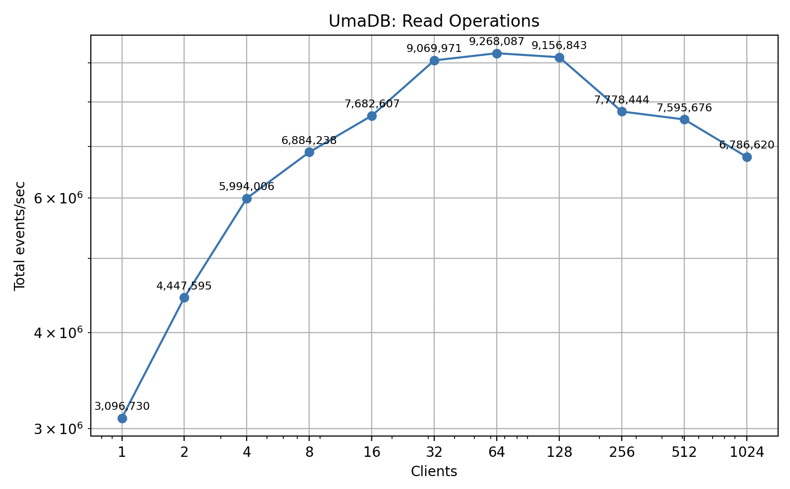

# What is UmaDB

**UmaDB** is a next-generation event store built for **dynamic consistency boundaries**.
UmaDB empowers event-driven architectures where consistency rules can adapt dynamically to
business needs, rather than being hardwired into the database.

UmaDB follows ideas first put forward by Sara Pellegrini, and directly implements the
[independent specification](https://dcb.events/specification/) for
[Dynamic Consistency Boundaries](https://dcb.events) created by Bastian Waidelich, Sara Pellegrini, and Paul Grimshaw.

Events are stored in an append-only sequence, indexed by monotonically increasing gapless positions,
and can be tagged for fast, precise filtering.

UmaDB offers:

* **High-performance concurrency**: non-blocking reads and writes via MVCC
* **Optimistic concurrency control** to prevent simultaneous write conflicts
* **Business-rule enforcement** via query-driven append conditions
* **Real-time subscriptions** with seamless catch-up and continuous delivery

Consistency boundaries are expressed as queries over event tags and types, allowing
applications to define constraints dynamically per write operation.

----

## Key Features

### Dynamic Consistency Boundaries

UmaDB lets you define exactly when an event can be appended, creating a flexible consistency boundary. You can:

* **Prevent conflicts with concurrent writes** by ensuring no new events have been added since a known point.
* **Enforce business rules** by preventing new events being appended if certain events already exist.

These controls can be combined to implement patterns like uniqueness constraints, idempotency, or coordinating
multi-step processes, all without relying on fixed aggregate boundaries.

### Multi-Version Concurrency Control

UmaDB uses **MVCC** to enable **high-concurrency reads and writes without blocking**. Each transaction sees a
consistent snapshot of the database. Append requests are atomic and crash safe. Space is efficiently reclaimed
once old versions are no longer referenced.

How it works (overview):

* Readers see a consistent snapshot and never block writers.
* Writers update data using copy-on-write, creating new versions of database pages.
* Committed updates are published atomically so readers always see a complete state.
* Old database pages are reclaimed safely once no active readers reference them.

This design combines non-blocking concurrency, atomic commits, and efficient space management, making UmaDB fast, safe,
and consistent under load.

### Reading and Subscribing

UmaDB supports both normal read and streaming subscriptions with "catch-up and continue" semantics:

* Normal reads deliver existing events and terminate
* Subscription reads deliver existing events, then block waiting for new events
* Read responses are streamed in batches, with each batch using a new reader to avoid long-held TSNs
* Server shutdown signals gracefully terminate all active subscriptions

### Append Request Batching

Concurrent append requests are automatically grouped and processed as a nested transaction:

* Requests are queued and collected into batches.
* A dedicated writer thread drains up to 1,000 requests per batch.
* Each request in the batch is processed individually, maintaining **per-request atomicity**.
* Dirty pages are flushed to disk once all requests in the batch have been processed.
* A new header page is written and flushed after all dirty pages are persisted.
* Individual responses are returned once the entire batch is successfully committed.

This approach **significantly improves throughput under concurrent load** by amortizing disk I/O
across multiple requests, while still ensuring **atomic per-request semantics** and **crash safety**.

----

## Core Concepts

### Events and Positions

Events are the fundamental unit of data in UmaDB. Each event is stored with a monotonically increasing
position that serves as its unique identifier in the global event sequence.

Every event stored in UmaDB is made up of four main parts:
* **Event type** — This is a label that describes what kind of event it is, such as `"OrderCreated"` or `"PaymentProcessed"`. It helps you understand and categorize what happened.
* **Data** — This is the actual content of the event, stored in a compact binary form. It can hold any structured information your application needs — for example, details of an order or a payment.
* **Tags** — Tags are attached to the event so that you can find or filter events later. For example, you might tag an event with `"customer:123"` or `"region:EU"`.
* **Position** — Every event is given a unique number when it’s written to the database. These numbers always increase, so they show the exact order in which events were added.

Event positions are:

* **Monotonically increasing**: Each appended event receives `position = last_position + 1`.
* **Globally unique**: No two events share the same position.
* **Sequential**: No gaps in the sequence (positions 1, 2, 3, ...).
* **Immutable**: Once assigned, an event's position never changes.


### Tags and Queries

A **tag** enables efficient filtered reading of events. Tags are arbitrary strings. Common patterns include:

* Entity identifiers: `"order:12345"`
* Categories: `"region:us-west"`
* Relationships: `"customer:789"`

A **query** specifies which events to select based on event types and tags. A query is made up of a
list of zero or more query items. Each query item describes a set of event tags and types to match against
event records.

When UmaDB runs a query, it selects all events that match the query, unless a position is given,
in which case only those events that have a greater position will be matched.

When matching events for a query, all events are matched in position order, unless any query items are
given, then only those that match at least one query item. An event matches a query item if its type is
in the query item types or there are no query item types, and if all the query item tags are in the event
tags.

In other words, if tags are provided, the event must include all of those tags to match the query item.
If no tags are given, the item matches events regardless of tags. If types are provided, only events of
those types match. If no types are given, all event types match. Each query item serves to expand the
set of matched events. If an event matches more than one query, it is included only once.

Queries are used both when reading events (to build a decision model) and when appending events (to implement
optimistic concurrent control over consistency boundaries).

In short, a DCB query defines what part of the event history matters for building a decision model and for
deciding whether a write is allowed. It’s flexible enough to express many business rules, such as uniqueness checks,
idempotency, or workflow coordination, all without hardcoding fixed entity or aggregate boundaries in the database.

----

## Architecture

UmaDB is organized into a set of layered components that work together to provide a durable, concurrent, and queryable
event store. Each layer has a clear responsibility, from client communication at the top to low-level file management
at the bottom. Requests typically flow *down* the stack, from client calls through the API and core logic into the
storage and persistence layers, while query results and acknowledgements flow *back up* the same path.

| **Layer** | **Component**                   | **Responsibility** |
|------------|---------------------------------|--------------------|
| **Client Layer** | gRPC Clients                    | Provides application-facing interfaces for reading and writing events |
| **API Layer** | gRPC API                        | Defines the public API surface (gRPC service) |
| **Core Logic Layer** | Event Store          | Implements transaction logic, batching, and concurrency control |
| **Storage Layer** | B+ Trees                        | Indexes events, tags, and free pages for efficient lookups |
| **Persistence Layer** | LMDB-like Pager and File System | Manages MVCC, page allocation, and durable file I/O |

### Data Flow Summary

1. **Clients** send read or write requests through gRPC interfaces.
2. The **API layer** validates inputs and routes requests to the event store core.
3. The **Core Logic Layer** applies transactional semantics, batching, and concurrency control.
4. The **Storage Layer** organizes and indexes event data for fast tag and position lookups.
5. Finally, the **Persistence Layer** ensures atomic page updates, durability, and crash recovery.
6. Query results or acknowledgements propagate back upward to the client.

### Storage and Persistence

UmaDB persists all data in a single paged file, using three specialized B+ trees each optimized for
different access patterns.

Two header nodes act as the entry point for all data structures and track the current
transaction sequence number (TSN), head position, and next never-unallocated page ID.

UmaDB maintains three specialized B+ trees in the same paged file:

* **Events Tree**: Maps each event position (monotonically increasing sequence number) to an event record,
 optimized for sequential scans and range queries.
* **Tags Tree**: Maps each tag to a list of positions or per-tag subtrees, optimized for filtered queries
 by event tags
* **Free Lists Tree**: Maps each TSN (transaction sequence number) to a list of freed page IDs, enabling
 efficient space reclamation

### Events Tree

The events tree is a position-ordered B+ tree that stores all events in UmaDB. Each event is assigned a
unique, monotonically increasing Position (a 64-bit unsigned integer) when appended, which serves as the
key in the tree.

* **Keys**: event position (64 bit integer)
* **Values**: event record (type, data, tags, and optionally overflow root page ID)

The events tree is the authoritative source for event data.

Events are stored using one of two strategies based on payload size:

* **Small events**: stored directly in the B+ tree leaf nodes
* **Large events**: stored in a chain of event data overflow pages

The overflow chain is a singly-linked list of pages.

The tree supports:

* Sequential appends
* Position lookups
* Range scans

The tags tree provides a secondary index into this tree but does not duplicate event payloads.

### Tags Tree

The tags tree provides an index from tag values to event positions. This enables efficient queries for
events matching specific tags or tag combinations, which is essential for filtering, subscriptions, and
enforcing business-level constraints.

* **Keys**: Tag hash (a stable 64-bit hash of the tag string)
* **Values**: List of event positions or pointer to per-tag subtrees for high-volume tags

The tags tree is optimized for:

* Fast insertion of new tag-position pairs during event appends
* Efficient lookup of all positions for a given tag, even for tags with many associated events
* Space efficiency for both rare and popular tags

The tags tree is a core component of UmaDB's storage layer, enabling efficient tag-based indexing and
querying of events. Its design supports both rare and high-frequency tags, with automatic migration to
per-tag subtrees for scalability. The implementation is robust, supporting copy-on-write, MVCC, and
efficient iteration for both reads and writes.

### Free Lists Tree

The free lists tree provides an index from TSN to page IDs. This enables efficient selection of reusable page IDs,
which is essential for efficient page reuse.

The free lists tree is a B+ tree where:

* **Keys**: TSN when pages were freed
* **Values**: List of freed Page IDs, or Page ID of per-TSN subtrees

The free lists tree is a core component of UmaDB's space management and page recycling strategy. Unlike the
events tree and the tags tree, the free lists tree supports removal of page IDs and TSNs.

The free lists tree is also implemented with the same copy-on-write semantics as everything else. The freed page
IDs from copied pages of the free lists tree are also stored in the free lists tree. The page IDs reused when writing
pages of the free lists tree are also removed from the free lists tree. All of this is settled during each
commit before the header node is written, ensuring the free list tree is also crash safe.

### MVCC and Concurrency

UmaDB implements multi-version concurrency control (MVCC) using a copy-on-write strategy. Each transaction
(read or write) operates on a consistent snapshot identified by the header with the highest TSN. Writers never
mutate pages in place; instead, they allocate new pages and atomically update the alternate header to publish
new roots.

When a writer modifies a page, it creates a new version rather than mutating the existing page in place. This
ensures readers holding older TSNs can continue traversing the old page tree without blocking. Without page
reuse, the database file would grow as each write creates new page versions, such that very quickly most of
the database file would contain inaccessible and useless old versions of pages.

The free lists tree records which pages have been copied and rewritten so that they can be safely reused.
Freed pages are stored in the free lists tree, indexed by the TSN at which they were freed. Pages can only
be reused once no active reader holds a TSN less than or equal to the freeing TSN. When pages are reused,
the page IDs are removed from the free lists tree. TSNs are removed when all freed page IDs have
been reused. Writers first attempt to reuse freed pages, falling back to allocating new pages. The database
file is only extended when there are no reusable page IDs. Batching read responses helps to ensure freed
pages are quickly reused.

Key points:

* **Readers**: Traverse immutable page versions, never block writers.
* **Writers**: Allocate new pages, update B+ trees, and commit by atomically updating the header.
* **Free Lists**: Track reusable pages by TSN, enabling efficient space reclamation.

Implementation details:

* The database file is divided into fixed-size pages with two header pages storing metadata (TSN, next event position, page IDs).
* Readers register their TSN and traverse immutable page versions.
* Writers receive a new TSN, copy and update pages, then atomically update the header.
* Free lists track pages by TSN for safe reclamation.
* Readers use a file-backed memory map of the database file to read database pages.
* Writers use file I/O operations to write database pages for control on when pages are flushed and synced to disk.

This design combines non-blocking concurrency, atomic commits, and efficient space management, making UmaDB fast, safe, and consistent under load.

#### Transaction Sequence Number (TSN)

UmaDB uses a monotonically increasing Transaction Sequence Number (TSN) as the versioning mechanism
for MVCC. Every committed write transaction increments the TSN, creating a new database snapshot.

The TSN is written into oldest header node at the end of each writer commit. Readers and writers
read both header pages and select the one with the higher TSN as the "newest" header.

#### Reader Transactions

A reader transaction captures a consistent snapshot of the database at a specific TSN. Readers
do not hold locks and never block writers or other readers.

Each reader holds:

* A transaction sequence number
* A snapshot of the B+ tree root page IDs

When a reader transaction starts, it adds its TSN to the register of reader TSNs.
And then when a reader transaction ends, it removes its TSN from the register of reader TSNs.
This enables the writers to determine which freed pages can be safely reused.

The register of reader TSNs allows writers to compute the minimum active reader TSN, which
determines which freed pages can be reused. Pages freed from lower TSNs can be reused.

#### Writer Transactions

Only one writer can execute at a time. This is enforced by the writer lock mutex, but in practice
there is no contention because there is only one append request handler thread.

A writer transaction takes a snapshot of the newest header, reads the reader TSN register, and finds all reusable
page IDs from the free lists tree. It executes append requests by first evaluating an append condition to look for
conflicting events. If no conflicting events are found, it appends new events by manipulating the B+ tree for events
and tags.

UmaDB writers never modify pages in place. Instead, writers create new page versions, leaving old
versions accessible to concurrent readers. When a writer needs to modify a page, it will:

* Allocate a new page ID (either from its reusable list of page IDs or by using a new database page)
* Clone the page content to the new PageID
* Add the new page to a map of dirty pages
* Add the old page ID to a list of freed page IDs

Once a page has been made "dirty" in this way, it may be modified several times by the same writer.

After all operations for appending new events have been completed, the reused page IDs are removed from
free lists tree, and the freed page IDs are inserted. Because this may involve further reuse and freeing
of page IDs, this process repeats until all freed page IDs have been inserted and all reused page IDs have
been removed.

Then, all dirty pages are written to the database file, and the database file is flushed and synced to disk. 

Then, the "oldest" header is overwritten with the writer's new TSN and the new page IDs of the B+ tree roots.
The database file is then again flushed and synced to disk.


This design yields crash-safe commits, allows concurrent readers without blocking, and efficiently reuses space.

----

## Benchmarks

The benchmark plot below shows total completed append operations per second from concurrent clients. Each client
is writing one event per request.


The benchmark plot below shows total completed append operations per second for concurrent clients, whilst there are four other
clients concurrently reading events. This plot shows writing is not significantly impeded by
concurrent readers.


The benchmark plot below shows total events received per second across concurrent client read operations, whilst clients
are throttled to process events at around 10,000 events per second. This plot shows concurrent readers scale quite linearly.


The benchmark plot below shows total events received per second across concurrent client read operations, whilst clients are not throttled.
The rate is ultimately constrained by the CPU and network channel limitations.



The benchmark plot below shows total events received per second across concurrent client read operations, whilst there are four other
clients concurrently appending events. This plot shows reading is not significantly impeded by
concurrent writers.


The benchmark plots above were produced on an Apple MacBook Pro M4 (10 performance cores and 4 efficiency cores).

## Running the UmaDB Server

Other distribution options are planned, but currently the only way to run UmaDB is to clone the Git repository
and build the project.

To build the project, you need to have Rust and Cargo installed. If you don't have them installed, you can get them from [rustup.rs](https://rustup.rs/).

Once you have Rust and Cargo installed, you can build the project with:

```bash
cargo build --release
```

This will create the UmaDB server executable `uma` in `target/release/`.

The UmaDB server can be started using the `uma` binary. You can run it directly after installing or building:

```bash
./target/release/uma --path /path/to/event-store --address 127.0.0.1:50051
```

Or you can use `cargo run` (dev build, builds faster, runs slower):

```bash
cargo run --bin uma -- --path /path/to/event-store --address 127.0.0.1:50051
```

### Command-line Options

The `uma` executable accepts the following command-line options:

- `-p, --path <PATH>`: Path to the event store directory (required)
- `-a, --address <ADDR>`: Address to listen on (default: "127.0.0.1:50051")
- `-h, --help`: Print help information
- `-V, --version`: Print version information

----

## gRPC API

This section documents the **UmaDB gRPC protocol** defined in `umadb.proto`.

You can interact with an UmaDB server using its gRPC API. The server implements the following methods:

- `Read`: Read events from the event store
- `Head`: Get the sequence position of the last recorded event
- `Append`: Append events to the event store

The protocol provides an interface for appending and reading events, querying by tags and types, and checking the current head position.

### Service Definition — `UmaDBService`

The main gRPC service for reading and appending events.

| RPC | Request | Response                                            | Description |
|------|----------|-----------------------------------------------------|-------------|
| `Read` | `ReadRequestProto` | **stream**&nbsp;`ReadResponseProto` | Streams events matching the query; may remain open if `subscribe=true`. |
| `Append` | `AppendRequestProto` | `AppendResponseProto`            | Appends new events atomically, returning the final sequence position. |
| `Head` | `HeadRequestProto` | `HeadResponseProto`              | Returns the current head position of the store. |


### Read Request — **`ReadRequestProto`**

Parameters for reading events from the store.

| Field | Type                 | Description |
|--------|----------------------|-------------|
| `query` | **optional**&nbsp;`QueryProto` | Optional filter for selecting specific event types or tags. |
| `after` | **optional**&nbsp;`uint64` | Start reading after this sequence number. |
| `limit` | **optional**&nbsp;`uint32` | Maximum number of events to return. |
| `subscribe` | **optional**&nbsp;`bool`   | If true, the stream remains open and continues delivering new events. |
| `batch_size` | **optional**&nbsp;`uint32` | Optional batch size hint for streaming responses. |

### Read Response — **`ReadResponseProto`**

Returned for each streamed message in response to a `Read` request.

| Field | Type                              | Description |
|--------|-----------------------------------|-------------|
| `events` | **repeated**&nbsp;`SequencedEventProto` | A batch of events matching the query. |
| `head` | **optional**&nbsp;`uint64`              | The current head position of the store when this batch was sent. |

When `subscribe = true`, multiple `ReadResponseProto` messages may be streamed as new events arrive.

When `subscribe = true`, the value of `head` will be empty.

When `limit` is empty, the value of `head` will be the position of the last recorded event in the database,
otherwise it will be the position of the last selected event.

### Append Request — **`AppendRequestProto`**

Request to append new events to the store.

| Field | Type                              | Description |
|--------|-----------------------------------|-------------|
| `events` | **repeated**&nbsp;`EventProto`          | Events to append, in order. |
| `condition` | **optional**&nbsp;`AppendConditionProto` | Optional condition to enforce optimistic concurrency or prevent conflicts. |

### Append Response — **`AppendResponseProto`**

Response after successfully appending events.

| Field | Type | Description |
|--------|------|-------------|
| `position` | `uint64` | Sequence position of the last appended event. |

With CQRS-style eventually consistent projections, clients can use the returned position to wait until downstream
event processing components have become up-to-data.

### Head Request — **`HeadRequestProto`**

Empty request used to query the current head of the event store.

_No fields._

### Head Response — **`HeadResponseProto`**

Response containing the current head position.

| Field | Type                 | Description |
|--------|----------------------|-------------|
| `position` | **optional**&nbsp;`uint64` | The latest known event position, or `None` if the store is empty. |

### Sequenced Event — **`SequencedEventProto`**

Represents an event along with its assigned sequence number.

| Field | Type | Description |
|--------|------|-------------|
| `position` | `uint64` | Monotonically increasing event position in the global log. |
| `event` | `EventProto` | The underlying event payload. |

### Event — **`EventProto`**

Represents a single event.

| Field | Type                 | Description |
|--------|----------------------|-------------|
| `event_type` | `string`             | The logical type or name of the event (e.g. `"UserRegistered"`). |
| `tags` | **repeated**&nbsp;`string` | Tags associated with the event for query matching and indexing. |
| `data` | `bytes`              | Serialized event data (e.g. JSON, CBOR, or binary payload). |

### Query — **`QueryProto`**

Encapsulates one or more `QueryItemProto`ueryitemproto) entries.

| Field | Type                         | Description |
|--------|------------------------------|-------------|
| `items` | **repeated**&nbsp;`QueryItemProto` | A list of query clauses (logical OR). |

### Query Item — **`QueryItemProto`**

Represents a **query clause** that matches a subset of events.

| Field | Type                 | Description                       |
|--------|----------------------|-----------------------------------|
| `types` | **repeated**&nbsp;`string` | List of event types (logical OR). |
| `tags` | **repeated**&nbsp;`string` | List of tags (logical AND).       |


### Append Condition  — **`AppendConditionProto`**

Optional conditions used to control whether an append should proceed.

| Field | Type                    | Description                                                     |
|--------|-------------------------|-----------------------------------------------------------------|
| `fail_if_events_match` | **optional**&nbsp;`QueryProto` | Prevents append if any events matching the query already exist. |
| `after` | **optional**&nbsp;`uint64`    | Only match events sequenced after this position.                |

### Error Response — **`ErrorResponseProto`**

Represents an application-level error returned by the service.

| Field | Type | Description |
|--------|------|-------------|
| `message` | `string` | Human-readable description of the error. |
| `error_type` | `ErrorType` | Classification of the error. |

### Error Type — **ErrorType**

| Value | Name | Description |
|--------|------|-------------|
| `0` | `IO` | Input/output error (e.g. storage or filesystem). |
| `1` | `SERIALIZATION` | Serialization or deserialization failure. |
| `2` | `INTEGRITY` | Logical integrity violation (e.g. condition failed). |
| `3` | `CORRUPTION` | Corrupted or invalid data detected. |
| `4` | `INTERNAL` | Internal server or database error. |

The "rich status" message can be used to extract structured error details.

### Summary

| Category | Message | Description |
|-----------|----------|-------------|
| **Event Model** | `EventProto`, `SequencedEventProto` | Core event representation. |
| **Queries** | `QueryProto`, `QueryItemProto` | Define filters for event selection. |
| **Conditions** | `AppendConditionProto` | Control write preconditions. |
| **Read/Write** | `ReadRequestProto`, `ReadResponseProto`, `AppendRequestProto`, `AppendResponseProto` | Reading and appending APIs. |
| **Meta** | `HeadRequestProto`, `HeadResponseProto` | Retrieve current head position. |
| **Errors** | `ErrorResponseProto` | Consistent error representation. |

### Example

Assuming the `umadb.proto` file has been compiled, using the gRPC API in Python code might look something like this.

```python
from umadb_pb2 import (
    EventProto,
    QueryItemProto,
    QueryProto,
    AppendConditionProto,
    ReadRequestProto,
    AppendRequestProto,
)
from umadb_pb2_grpc import UmaDBServiceStub
import grpc

# Connect to the gRPC server
channel = grpc.insecure_channel("127.0.0.1:50051")
client = UmaDBServiceStub(channel)

# Define a consistency boundary
cb = QueryProto(
    items=[
        QueryItemProto(
            types=["example"],
            tags=["tag1", "tag2"],
        )
    ]
)

# Read events for a decision model
read_request = ReadRequestProto(
    query=cb,
    after=None,
    limit=None,
    subscribe=False,
    batch_size=None,
)
read_stream = client.Read(read_request)

# Build decision model
last_head = None
for read_response in read_stream:
    for sequenced_event in read_response.events:
        print(
            f"Got event at position {sequenced_event.position}: {sequenced_event.event}"
        )
    last_head = read_response.head

print("Last known position is:", last_head)

# Produce new event
event = EventProto(
    event_type="example",
    tags=["tag1", "tag2"],
    data=b"Hello, world!",
)

# Append event in consistency boundary
append_request = AppendRequestProto(
    events=[event],
    condition=AppendConditionProto(
        fail_if_events_match=cb,
        after=last_head,
    ),
)
commit_response = client.Append(append_request)
commit_position = commit_response.position
print("Appended event at position:", commit_position)

# Append conflicting event - expect an error
conflicting_request = AppendRequestProto(
    events=[event],
    condition=AppendConditionProto(
        fail_if_events_match=cb,
        after=last_head,
    ),
)
try:
    conflicting_response = client.Append(conflicting_request)
    # If no exception, this is unexpected
    raise RuntimeError("Expected IntegrityError but append succeeded")
except grpc.RpcError as e:
    # Translate gRPC error codes to logical DCB errors if desired
    if e.code() == grpc.StatusCode.FAILED_PRECONDITION:
        print("Error appending conflicting event:", e.details())
    else:
        raise

# Subscribe to all events for a projection
subscription_request = ReadRequestProto(
    query=None,
    after=None,
    limit=None,
    subscribe=True,
    batch_size=None,
)
subscription_stream = client.Read(subscription_request)

# Build an up-to-date view
for read_response in subscription_stream:
    for ev in read_response.events:
        print(f"Processing event at {ev.position}: {ev.event}")
        if ev.position == commit_position:
            print("Projection has processed new event!")
            break

```

----

## Rust Clients

The project provides both **asynchronous** and **synchronous** clients for reading and appending events.

The synchronous client functions effectively as a wrapper around the asynchronous client.

### Retrieve Events from UmaDB  — `read()`

Reads events from the event store, optionally with filters, sequence position, limits, and live subscription support.

Fetches events from the store in order, returning them as an event stream.  

Arguments:

| Parameter | Type | Description |
|------------|------|-------------|
| `query` | `Option<DCBQuery>` | Optional structured query to filter events (by tags, event types, etc). |
| `after` | `Option<u64>` | Start reading *after* this sequence number. Only events with greater positions are returned. |
| `limit` | `Option<usize>` | Optional cap on the number of events to retrieve. |
| `subscribe` | `bool` | If `true`, keeps the stream open to deliver future events as they arrive. |
| `batch_size` | `Option<usize>` | Optional hint for how many events to buffer per batch from the server. |

Returns a "read response" instance from which selected events and the "last known position" can be obtained.

| Interface | Response Type | Description |
|------------|----------------|-------------|
| **Async** | `AsyncReadResponse` | An asynchronous stream of events that can be awaited or iterated via `.next().await`. |
| **Sync** | `SyncReadResponse` | A blocking iterator-style wrapper that uses the async client internally. |

This method can be used both for constructing decision models in a domain layer, and for projecting events into
materialized views in CQRS.

### Add Events to the UmaDB  — `append()`

Appends new events to the store atomically, with optional optimistic concurrency conditions.

Writes one or more events to the event log in order.

Arguments:

| Parameter | Type | Description |
|------------|------|-------------|
| `events` | `Vec<DCBEvent>` | The list of events to append. Each includes an event type, tags, and data payload. |
| `condition` | `Option<DCBAppendCondition>` | Optional append condition (e.g. `After(u64)`) to ensure no conflicting writes occur. |

Returns the **sequence number** (`u64`) of the last successfully appended event.

This value can be used to wait for downstream event-processing components in
a CQRS system to become up-to-date.

### Examples

Here's an example of how to use the synchronous Rust client for UmaDB:

```rust
use std::sync::Arc;
use umadb::dcb::{
    DCBAppendCondition, DCBError, DCBEvent, DCBEventStoreSync, DCBQuery, DCBQueryItem,
};
use umadb::grpc::UmaDBClient;

fn main() -> Result<(), Box<dyn std::error::Error>> {
    // Connect to the gRPC server
    let client = UmaDBClient::connect("http://127.0.0.1:50051")?;

    // Define a consistency boundary
    let cb = Arc::new(DCBQuery {
        items: vec![DCBQueryItem {
            types: vec!["example".to_string()],
            tags: vec!["tag1".to_string(), "tag2".to_string()],
        }],
    });

    // Read events for a decision model
    let mut read_response = client.read(Some(cb.clone()), None, None, false, None)?;

    // Build decision model
    while let Some(result) = read_response.next() {
        match result {
            Ok(event) => {
                println!(
                    "Got event at position {}: {:?}",
                    event.position, event.event
                );
            }
            Err(status) => panic!("gRPC stream error: {}", status),
        }
    }

    // Remember the last-known position
    let last_known_position = read_response.head().unwrap();
    println!("Last known position is: {:?}", last_known_position);

    // Produce new event
    let event = DCBEvent {
        event_type: "example".to_string(),
        tags: vec!["tag1".to_string(), "tag2".to_string()],
        data: b"Hello, world!".to_vec(),
    };

    // Append event in consistency boundary
    let commit_position = client.append(
        vec![event.clone()],
        Some(DCBAppendCondition {
            fail_if_events_match: cb.clone(),
            after: last_known_position,
        }),
    )?;
    println!("Appended event at position: {}", commit_position);

    // Append conflicting event - expect an error
    let conflicting_result = client.append(
        vec![event.clone()],
        Some(DCBAppendCondition {
            fail_if_events_match: cb.clone(),
            after: last_known_position,
        }),
    );

    match conflicting_result {
        Err(DCBError::IntegrityError(integrity_error)) => {
            println!("Error appending conflicting event: {:?}", integrity_error);
        }
        other => panic!("Expected IntegrityError, got {:?}", other),
    }

    // Subscribe to all events for a projection
    let mut subscription = client.read(None, None, None, true, None)?;

    // Build an up-to-date view
    while let Some(result) = subscription.next() {
        match result {
            Ok(ev) => {
                println!("Processing event at {}: {:?}", ev.position, ev.event);
                if ev.position == commit_position {
                    println!("Projection has processed new event!");
                    break;
                }
            }
            Err(status) => panic!("gRPC stream error: {}", status),
        }
    }

    Ok(())
}
```

Here's an example of how to use the asynchronous Rust client for UmaDB:

```rust
use futures::StreamExt;
use std::sync::Arc;
use umadb::dcb::{
    DCBAppendCondition, DCBError, DCBEvent, DCBEventStoreAsync, DCBQuery, DCBQueryItem,
};
use umadb::grpc::AsyncUmaDBClient;

#[tokio::main]
async fn main() -> Result<(), Box<dyn std::error::Error>> {
    // Connect to the gRPC server
    let client = AsyncUmaDBClient::connect("http://127.0.0.1:50051").await?;

    // Define a consistency boundary
    let cb = Arc::new(DCBQuery {
        items: vec![DCBQueryItem {
            types: vec!["example".to_string()],
            tags: vec!["tag1".to_string(), "tag2".to_string()],
        }],
    });

    // Read events for a decision model
    let mut read_response = client
        .read(Some(cb.clone()), None, None, false, None)
        .await?;

    // Build decision model
    while let Some(result) = read_response.next().await {
        match result {
            Ok(event) => {
                println!(
                    "Got event at position {}: {:?}",
                    event.position, event.event
                );
            }
            Err(status) => panic!("gRPC stream error: {}", status),
        }
    }

    // Remember the last-known position
    let last_known_position = read_response.head().await?;
    println!("Last known position is: {:?}", last_known_position);

    // Produce new event
    let event = DCBEvent {
        event_type: "example".to_string(),
        tags: vec!["tag1".to_string(), "tag2".to_string()],
        data: b"Hello, world!".to_vec(),
    };

    // Append event in consistency boundary
    let commit_position = client
        .append(
            vec![event.clone()],
            Some(DCBAppendCondition {
                fail_if_events_match: cb.clone(),
                after: last_known_position,
            }),
        )
        .await?;
    println!("Appended event at position: {}", commit_position);

    // Append conflicting event - expect an error
    let conflicting_result = client
        .append(
            vec![event.clone()],
            Some(DCBAppendCondition {
                fail_if_events_match: cb.clone(),
                after: last_known_position,
            }),
        )
        .await;

    match conflicting_result {
        Err(DCBError::IntegrityError(integrity_error)) => {
            println!("Error appending conflicting event: {:?}", integrity_error);
        }
        other => panic!("Expected IntegrityError, got {:?}", other),
    }

    // Subscribe to all events for a projection
    let mut subscription = client.read(None, None, None, true, None).await?;

    // Build an up-to-date view
    while let Some(result) = subscription.next().await {
        match result {
            Ok(ev) => {
                println!("Processing event at {}: {:?}", ev.position, ev.event);
                if ev.position == commit_position {
                    println!("Projection has processed new event!");
                    break;
                }
            }
            Err(status) => panic!("gRPC stream error: {}", status),
        }
    }
    Ok(())
}
```

----

## License

Licensed under either of

- Apache License, Version 2.0 (LICENSE-APACHE or http://www.apache.org/licenses/LICENSE-2.0)
- MIT license (LICENSE-MIT or http://opensource.org/licenses/MIT)

at your option.

### Contribution

Unless you explicitly state otherwise, any contribution intentionally submitted for inclusion in this crate by you, as defined in the Apache-2.0 license, shall be dual licensed as above, without any additional terms or conditions.
